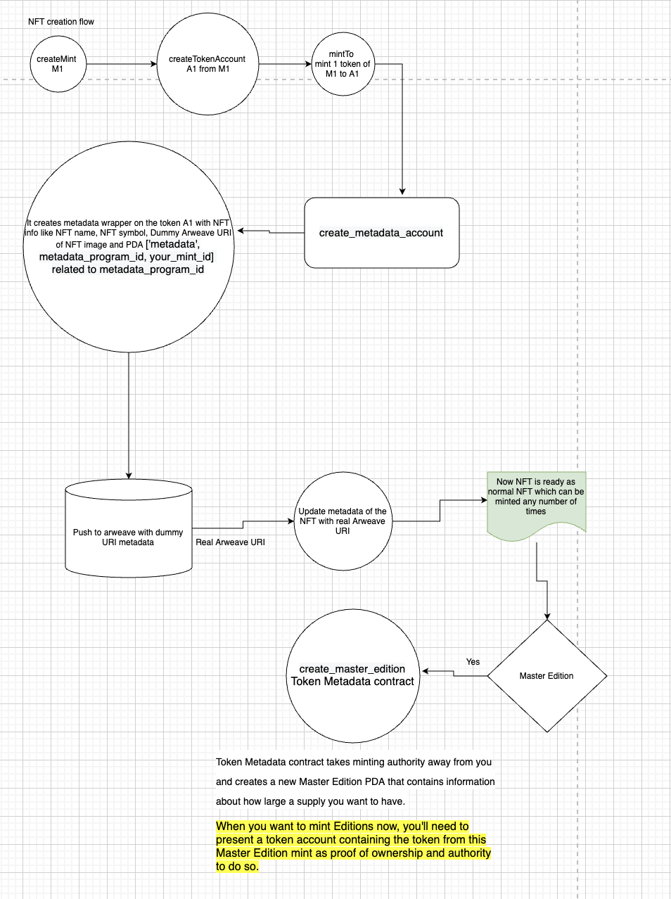
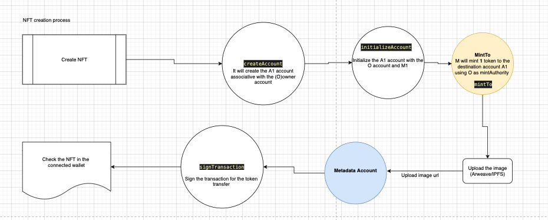

# Create and Burn NFT on Solana Blockchain using only Web3

In this quest we will be working on creating our own NFT (Non-Fungible Token) in Solana Blockchain using web3.js only.Everyday we hear the term NFT and few of the NFTs get sold for millions as well. So in this quest we will deep dive into the NFT creation and burning process.

## What will you get after going through this quest ?


1. You will understand the difference between Fungible Token and NFT (Non-Fungible Token).
2. You will understand how to **create** your own NFT.
3. You will understand what a Metadata account is and why it is important to create NFT.
4. You will understand how to **burn** your NFT.
5. You will understand the importance of associated accounts while creating the NFT.

## What is the difference between Fungible Token and Non-Fungible Token (NFT) ?

**Fungible token : **The tokens which have the supply of more than 1 and can be distributed to different users.

**Non-Fungible token**: The tokens which can only have the maximum supply of 1 and can only be transferred to different users instead of any new token generation.

The total supply will always remain 1 for the NFT which makes it unique as compared to Fungible token which can be minted/created more depending on the need.

Hence NFT (Non-Fungible Token) is a form of token which can exist uniquely throughout the world. You can assume it as an email address, once you own it , nobody else can claim the same email address.

It provides the ownership of the digital asset which can be uniquely identified forever.

## Why create your own NFT ?

Creating our own token which can uniquely exist gives us the feeling of ownership. You can claim any artwork or any piece of unique art which you think can have value in the future.

These days NFTs are also being categorised under the future investment as with the more adoption of blockchain, it is believed that value of NFTs will increase in future.

## Prerequisites to work on this quest


1. Knowledge of crypto wallet (Phantom wallet specifically).
2. A basic react app with wallet connectivity feature.
3. Solana cluster can be : local, devnet or testnet.
4. Funded Solana wallet atleast 0.5 SOL .
5. For better understanding, please go through our first quest on **creating a wallet connection** with react app.

## Folder structure expected of the react app to run this quest


* Assuming app name as "DistributeToken"
    * App-Name
        * node_modules
        * public
        * src
            * utils
                * nftCreation.js
                * nftBurn.js
                * programId.js
            * App.js
            * Index.js
            * Package.json

## Basic terminologies to digest before we jump into the quest


1. **Borsh:** A  library which helps in serialising the create NFT transaction. Serialisation is the process of converting an object into a stream of bytes which can be used by on-chain programs to again deserialize it to read the instructions and perform actions on it.
2. **Minting Token:** When you try to print new currency notes in the real world, it increases the supply of the notes. In the same way, if we need to increase the supply of our token in the market then we mint (print) the tokens to an associated account. \
Minting process will increase the total supply of the custom token. In the case of NFT, the total supply can be only 1.

## Metaplex NFT creation flow with metadata


## NFT creation flow


## Create NFT util functions


As NFTs are meant to be represented in the form of image/video/gif, hence each NFT needs to be associated with a metadata account which can hold the image/video/gif for the NFT and fetch the data wherever needed.

We will be using **arweave **blockchain based data hosting service, which is decentralised and distributed across the network.

**File: src/utils/nftCreation.js**

In this code snippet we will talk about the different libraries which are needed to work on this quest.

**borsh:** It is a library which provides us the functionality of serialization or deserialization of data. 

**bs58**: It helps to encode the string to base 58 encoding. 

**@solana/spl-token :** It is a library which holds all the util functions to create the token on the solana blockchain.

**crypto:** It is an algorithm that performs data encryption and decryption.

**bn.js:** The BN.js library for calculating with big numbers in JavaScript.

**@solana/web3.js:** It helps to prepare the instruction for transactions using various util methods.


```
import { BinaryReader, BinaryWriter } from 'borsh';
import base58 from 'bs58';
import * as splToken from '@solana/spl-token'
import crypto from 'crypto';
import BN from 'bn.js';
import { serialize } from 'borsh';
import {
   Keypair,
     PublicKey,
     Transaction,
     clusterApiUrl,
     SystemProgram,
     SYSVAR_RENT_PUBKEY,
     TransactionInstruction
   } from "@solana/web3.js";
```


**sleepUtil:** This util function will help to make the setTimeOut work as a synchronous function. With the help of this function we can wait synchronously at any place in the code.

**NETWORK:** This parameter signifies to which cluster of Solana the application will be connected to.

Other variables mentioned below are the predefined standards from the Metaplex which internally uses metadata on-chain program to store all the artifacts of the NFT.

**File: src/utils/nftCreation.js**


```
export const TOKEN_PROGRAM_ID = new PublicKey(
 'TokenkegQfeZyiNwAJbNbGKPFXCWuBvf9Ss623VQ5DA',
);
const SPL_ASSOCIATED_TOKEN_ACCOUNT_PROGRAM_ID = new PublicKey(
 'ATokenGPvbdGVxr1b2hvZbsiqW5xWH25efTNsLJA8knL',
);

const METADATA_PROGRAM_ID =
   'metaqbxxUerdq28cj1RbAWkYQm3ybzjb6a8bt518x1s';

const MEMO_ID = new PublicKey(
 'MemoSq4gqABAXKb96qnH8TysNcWxMyWCqXgDLGmfcHr',
);

const programIds = {
 token: TOKEN_PROGRAM_ID,
 associatedToken: SPL_ASSOCIATED_TOKEN_ACCOUNT_PROGRAM_ID,
 metadata: METADATA_PROGRAM_ID,
 memo: MEMO_ID,
}

const sleepUtil = (ms) => {
   return new Promise(resolve => setTimeout(resolve, ms));
 }
export const NETWORK = clusterApiUrl("devnet");
export const AR_SOL_HOLDER_ID = new PublicKey(
   'HvwC9QSAzvGXhhVrgPmauVwFWcYZhne3hVot9EbHuFTm',
);
export const METADATA_PREFIX = 'metadata';
export const EDITION = 'edition';
export const EDITION_MARKER_BIT_SIZE = 248;
export const DEFAULT_TIMEOUT = 15000;
export const RESERVED_TXN_MANIFEST = 'manifest.json';
export const MetadataKey = {
   Uninitialized : 0,
   MetadataV1 : 4,
   EditionV1 : 1,
   MasterEditionV1 : 2,
   MasterEditionV2 : 6,
   EditionMarker : 7,
}
export const TOKEN_PROGRAM_ID = programIds.token
```


## On-chain program’s data structures


On-chain program expects the data to be in structure format hence to pass a valid format the class needs to be created and then serialised through Borsh serialiser.

Serialisation is important without which an on-chain program will not be able to deserialize the instruction data and it will return fatal error.

**CreateMetadataArgs:** This defines the structure of the data which is expected from the Metaplex on-chain programs to perform the NFT creation action.

**UpdateMetadataArgs:** This defines the structure of the data to update the metadata of the NFT, without which we can not update the metadata of the NFT.

**CreateMasterEditionArgs:** This defines the structure of the data which needs to create Master Edition of the NFT, which can be minted to other NFTs in the future. Users can set the max supply for the master edition which can be minted.

**Creator**: This defines the structure of the data for the creator of the NFT. This information will be injected to each NFT which gets minted on the blockchain.

**Metadata:** This defines the structure of the metadata data which will be associated with each NFT minted on the blockchain. In the metadata we can store the images, videos on the NFT which can be sold on NFT marketplaces.


```
/**
* Classes to be used to create the NFT
*/

class CreateMetadataArgs {
   instruction= 0;
   data;
   isMutable;
    constructor(args) {
     this.data = args.data;
     this.isMutable = args.isMutable;
   }
 }

 class UpdateMetadataArgs {
   instruction= 1;
   data;
   // Not used by this app, just required for instruction
   updateAuthority;
   primarySaleHappened;
   constructor(args) {
     this.data = args.data ? args.data : null;
     this.updateAuthority = args.updateAuthority ? args.updateAuthority : null;
     this.primarySaleHappened = args.primarySaleHappened;
   }
 }

 class CreateMasterEditionArgs {
   instruction = 10;
   maxSupply;
   constructor(args) {
     this.maxSupply = args.maxSupply;
   }
 }

 class Edition {
   key;
   /// Points at MasterEdition struct
   parent;
   /// Starting at 0 for master record, this is incremented for each edition minted.
   edition;
    constructor(args) {
     this.key = MetadataKey.EditionV1;
     this.parent = args.parent;
     this.edition = args.edition;
   }
 }
 export class Creator {
   address;
   verified;
   share;
    constructor(args) {
     this.address = args.address;
     this.verified = args.verified;
     this.share = args.share;
   }
 }
  class Data {
   name;
   symbol;
   uri;
   sellerFeeBasisPoints;
   creators;
   constructor(args) {
     this.name = args.name;
     this.symbol = args.symbol;
     this.uri = args.uri;
     this.sellerFeeBasisPoints = args.sellerFeeBasisPoints;
     this.creators = args.creators;
   }
 }
  class Metadata {
   key;
   updateAuthority;
   mint;
   data;
   primarySaleHappened;
   isMutable;
   editionNonce;
    // set lazy
   masterEdition;
   edition;
    constructor(args) {
     this.key = MetadataKey.MetadataV1;
     this.updateAuthority = args.updateAuthority;
     this.mint = args.mint;
     this.data = args.data;
     this.primarySaleHappened = args.primarySaleHappened;
     this.isMutable = args.isMutable;
     this.editionNonce = args.editionNonce;
   }
    async init() {
     const edition = await getEdition(this.mint);
     this.edition = edition;
     this.masterEdition = edition;
   }
 }

 class MintPrintingTokensArgs {
   instruction9;
   supply;
    constructor(args) {
     this.supply = args.supply;
   }
 }

 class MasterEditionV1 {
   key;
   supply;
   maxSupply;
   /// Can be used to mint tokens that give one-time permission to mint a single limited edition.
   printingMint;
   /// If you don't know how many printing tokens you are going to need, but you do know
   /// you are going to need some amount in the future, you can use a token from this mint.
   /// Coming back to token metadata with one of these tokens allows you to mint (one time)
   /// any number of printing tokens you want. This is used for instance by Auction Manager
   /// with participation NFTs, where we dont know how many people will bid and need participation
   /// printing tokens to redeem, so we give it ONE of these tokens to use after the auction is over,
   /// because when the auction begins we just dont know how many printing tokens we will need,
   /// but at the end we will. At the end it then burns this token with token-metadata to
   /// get the printing tokens it needs to give to bidders. Each bidder then redeems a printing token
   /// to get their limited editions.
   oneTimePrintingAuthorizationMint;
    constructor(args) {
     this.key = MetadataKey.MasterEditionV1;
     this.supply = args.supply;
     this.maxSupply = args.maxSupply;
     this.printingMint = args.printingMint;
     this.oneTimePrintingAuthorizationMint =
       args.oneTimePrintingAuthorizationMint;
   }
 }
  class MasterEditionV2 {
   key;
   supply;
   maxSupply;
    constructor(args) {
     this.key = MetadataKey.MasterEditionV2;
     this.supply = args.supply;
     this.maxSupply = args.maxSupply;
   }
 }

 class EditionMarker {
   key;
   ledger;
    constructor(args) {
     this.key = MetadataKey.EditionMarker;
     this.ledger = args.ledger;
   }
    editionTaken(edition) {
     const editionOffset = edition % EDITION_MARKER_BIT_SIZE;
     const indexOffset = Math.floor(editionOffset / 8);
      if (indexOffset > 30) {
       throw Error('bad index for edition');
     }
      const positionInBitsetFromRight = 7 - (editionOffset % 8);
      const mask = Math.pow(2, positionInBitsetFromRight);
      const appliedMask = this.ledger[indexOffset] & mask;
      return appliedMask != 0;
   }
 }
```


## Connection provider to the Phantom Wallet


In the utility function below, we are trying to connect to the wallet if it is not connected already.

The util function will alert the user if there is no Phantom Wallet present as a chrome extension.

Phantom wallet as extension injects the “solana” object in the global object of the browser ie. “window” object. We check the existence of wallet by checking the existence of “solana” in the window object.


```
/**
* Helpder function to detect whether Phantom wallet extension installed or not
* @param {*} connectToWallet
* @returns
*/
export const connectOrGetPhantomProvider = (connectToWallet) => {
   if ("solana" in window) {
     const provider = window.solana;
     if(connectToWallet && !window.solana.isConnected){
           window.solana.connect();
       }
       if (provider.isPhantom) {
           return provider;
       }
   }else if(connectToWallet){
     alert(`Please install the phantom wallet from https://phantom.app/`);
   }


};
```


## DOM to Image util function


To create NFT which can hold the image as the metadata we need to provide the image in the form of base64 encoded string and from base64 to file object which eventually gets uploaded to arweave.

So the prepare the file object of the image, we wrote our custom function which can convert any DOM element to base64 string and then base64 to File object.


```
/**
* Helper function to convert base64 to file object
* @param {*} dataurl
* @param {*} filename
* @returns
*/
export const dataURLtoFile = (dataurl, filename) => {
   let arr = dataurl.split(','), mime = arr[0].match(/:(.*?);/)[1],
       bstr = atob(arr[1]), n = bstr.length, u8arr = new Uint8Array(n);
       while(n--){
           u8arr[n] = bstr.charCodeAt(n);
       }
       return new File([u8arr], filename, {type:mime});
}
```


**Borsch extended functionality**

This functionality is provided by the Metaplex team where they added an extra util function to the BinaryReader to make the communication seamless with metaplex on-chain programs.

Without the appropriate serialization, the NFT creation will not work as the transaction will not be deserialized properly from the on-chain programs.


```
/**
* Utility to add functionality to BinaryReader
*/
export const extendBorsh = () => {
(BinaryReader.prototype).readPubkey = function () {
   const reader = this;
   const array = reader.readFixedArray(32);
   return new PublicKey(array);
};

(BinaryWriter.prototype).writePubkey = function (value) {
   const writer = this;
   writer.writeFixedArray(value.toBuffer());
};

(BinaryReader.prototype).readPubkeyAsString = function () {
   const reader = this;
   const array = reader.readFixedArray(32);
   return base58.encode(array);
};

(BinaryWriter.prototype).writePubkeyAsString = function (
   value,
) {
   const writer = this;
   writer.writeFixedArray(base58.decode(value));
};
};
extendBorsh();
```


**mintNFT: **It is a utility wrapper function which expects different parameters to create the NFT process. All the required parameters are explained below.

**createMint: **It is** **to create the minting address for the NFT with the required parameters.


1. **Instructions**: It includes all the instructions related to mint creation, associate account creation and metadata upload.
2. **payer**: This parameter defines the payer of the transaction.
3. **mintRentExempt: **This parameter is required to enable rent free account on Solana blockchain.
4. **decimals: **This parameter is required to tell how many decimals will be placed with the mint key. In the case of NFT, where maximum supply needs to be 1 only, then it will be passed as 0.
5. **owner: **This parameter tells about the owner of the wallet as well as owner of the NFT which will be minted/created.
6. **freezeAuthority: **This parameter tells who can freeze authority of the NFT created. Freezing authority is a super set of owners and can override the actions of the owner.
7. **signers: **This parameter tells about the signers of the transaction, of course while creating the NFT, connected wallet will act as a signer.


```
 export const mintNFT = async function(
   connection,
   provider,
   env,
   files,
   metadata){

   const wallet = provider
   const metadataContent = {
         name: metadata.name,
         symbol: metadata.symbol,
         description: metadata.description,
         seller_fee_basis_points: metadata.sellerFeeBasisPoints,
         image: metadata.image,
         animation_url: metadata.animation_url,
         external_url: metadata.external_url,
         properties: {
           ...metadata.properties,
           creators: metadata.creators.map(creator => {
             return {
               address: creator.address,
               share: creator.share,
             };
           }),
         },
     };
   const realFiles = [
     ...files,
     new File([JSON.stringify(metadataContent)], 'metadata.json'),
   ];

   const { instructions: pushInstructions, signers: pushSigners } = await prepPayForFilesTxn(wallet, realFiles, metadata);

    // Allocate memory for the account
   const mintRent = await connection.getMinimumBalanceForRentExemption(
     splToken.MintLayout.span
   );

   const payerPublicKey = wallet.publicKey.toBase58();
   const instructions = [...pushInstructions];
   const signers = [...pushSigners];

    // This is only temporarily owned by wallet...transferred to program by createMasterEdition below
   const mintKey = createMint(
     instructions,
     wallet.publicKey,
     mintRent,
     0,
     // Some weird bug with phantom where it's public key doesnt mesh with data encode wellff
     new PublicKey(payerPublicKey),
     new PublicKey(payerPublicKey),
     signers,
   ).toBase58();

   const recipientKey = (
     await findProgramAddress(
       [
         wallet.publicKey.toBuffer(),
         programIds.token.toBuffer(),
         new PublicKey(mintKey).toBuffer(),
       ],
       programIds.associatedToken,
     )
   )[0];

   createAssociatedTokenAccountInstruction(
     instructions,
     new PublicKey(recipientKey),
     wallet.publicKey,
     wallet.publicKey,
     new PublicKey(mintKey),
   );
   const classData = new Data({
     symbol: metadata.symbol,
     name: metadata.name,
     uri:' '.repeat(64), // size of url for arweave
     sellerFeeBasisPoints: metadata.sellerFeeBasisPoints,
     creators: metadata.creators,
   })
   const metadataAccount = await createMetadata(
     classData,
     payerPublicKey,
     mintKey,
     payerPublicKey,
     instructions,
     wallet.publicKey.toBase58(),
   );
   const { txid } = await sendTransactionWithRetry(
     connection,
     wallet,
     instructions,
     signers,
   );
   try {
     // return
    await connection.confirmTransaction(txid, 'max');
   } catch {
     // ignore
   }

   await connection.getParsedConfirmedTransaction(txid, 'confirmed');

   const data = new FormData();

   const tags = realFiles.reduce(
     (acc, f) => {
       acc[f.name] = [{ name: 'mint', value: mintKey }];
       return acc;
     },
     {},
   );
   data.append('tags', JSON.stringify(tags));
   data.append('transaction', txid);
   realFiles.map(f => data.append('file[]', f));

   const result = await (
     await fetch(
       'https://us-central1-principal-lane-200702.cloudfunctions.net/uploadFile2',
       {
         method: 'POST',
         body: data,
       },
     )
   ).json();

   const metadataFile = result.messages?.find(
     m => m.filename === RESERVED_TXN_MANIFEST,
   );
   let arweaveLink = ""
   if(metadataFile?.transactionId){
     const updateInstructions = [];
   const updateSigners= [];
   arweaveLink = `https://arweave.net/${metadataFile.transactionId}`;
   await updateMetadata(
     new Data({
       name: metadata.name,
       symbol: metadata.symbol,
       uri: arweaveLink,
       creators: metadata.creators,
       sellerFeeBasisPoints: metadata.sellerFeeBasisPoints,
     }),
     undefined,
     undefined,
     mintKey,
     payerPublicKey,
     updateInstructions,
     metadataAccount,
   );

   updateInstructions.push(
     splToken.Token.createMintToInstruction(
       TOKEN_PROGRAM_ID,
       new PublicKey(mintKey),
       new PublicKey(recipientKey),
       new PublicKey(payerPublicKey),
       [],
       1,
     ),
   );

   await createMasterEdition(
     new BN(1),
     mintKey,
     payerPublicKey,
     payerPublicKey,
     payerPublicKey,
     updateInstructions,
   );

   await sendTransactionWithRetry(
     connection,
     wallet,
     updateInstructions,
     updateSigners,
   );}
   return { metadataAccount, arweaveLink, mintKey, account: recipientKey };
 }

 //END the mintNFT

 /**
  *
  * @param {*} maxSupply
  * @param {*} mintKey
  * @param {*} updateAuthorityKey
  * @param {*} mintAuthorityKey
  * @param {*} payer
  * @param {*} instructions
  */

 async function createMasterEdition(
   maxSupply,
   mintKey,
   updateAuthorityKey,
   mintAuthorityKey,
   payer,
   instructions,
 ) {
   const metadataProgramId = programIds.metadata;
    const metadataAccount = (
     await findProgramAddress(
       [
         Buffer.from(METADATA_PREFIX),
         new PublicKey(metadataProgramId).toBuffer(),
         new PublicKey(mintKey).toBuffer(),
       ],
       new PublicKey(metadataProgramId),
     )
   )[0];
    const editionAccount = (
     await findProgramAddress(
       [
         Buffer.from(METADATA_PREFIX),
         new PublicKey(metadataProgramId).toBuffer(),
         new PublicKey(mintKey).toBuffer(),
         Buffer.from(EDITION),
       ],
       new PublicKey(metadataProgramId),
     )
   )[0];
    const value = new CreateMasterEditionArgs({ maxSupply: maxSupply || null });
   const data = Buffer.from(serialize(METADATA_SCHEMA, value));
    const keys = [
     {
       pubkey: new PublicKey(editionAccount),
       isSigner: false,
       isWritable: true,
     },
     {
       pubkey: new PublicKey(mintKey),
       isSigner: false,
       isWritable: true,
     },
     {
       pubkey: new PublicKey(updateAuthorityKey),
       isSigner: true,
       isWritable: false,
     },
     {
       pubkey: new PublicKey(mintAuthorityKey),
       isSigner: true,
       isWritable: false,
     },
     {
       pubkey: new PublicKey(payer),
       isSigner: true,
       isWritable: false,
     },
     {
       pubkey: new PublicKey(metadataAccount),
       isSigner: false,
       isWritable: false,
     },
      {
       pubkey: programIds.token,
       isSigner: false,
       isWritable: false,
     },
     {
       pubkey: SystemProgram.programId,
       isSigner: false,
       isWritable: false,
     },
     {
       pubkey: SYSVAR_RENT_PUBKEY,
       isSigner: false,
       isWritable: false,
     },
   ];
    instructions.push(
     new TransactionInstruction({
       keys,
       programId: new PublicKey(metadataProgramId),
       data,
     }),
   );
 }
```


**prepPayForFilesTxn:** It is used to calculate the fees for the files which need to be uploaded to arweave. It is mentioned in the arweave documentation that you need Tokens to upload onto the arweave platform but none of the creators faced any such issue yet.

**findProgramAddress:** It is used to find the account address based on the program id and seed provided. It is a deterministic function, hence it will always provide the address for the same seed and same program id.

Deterministic function is needed because it will help to deduplicate any associated account with the same mintKey.


```
 const prepPayForFilesTxn = async (
   wallet,
   files,
   metadata,
 ) => {
   const memo = programIds.memo;
    const instructions= [];
   const signers= [];
    if (wallet.publicKey)
     instructions.push(
       SystemProgram.transfer({
         fromPubkey: wallet.publicKey,
         toPubkey: AR_SOL_HOLDER_ID,
         lamports: 100000000,
       }),
     );
    //Already uploading files on IPFS, hence no files to be transacted here
   for (let i = 0; i < files.length; i++) {
     const hashSum = crypto.createHash('sha256');
     hashSum.update(await files[i].text());
     const hex = hashSum.digest('hex');
     instructions.push(
       new TransactionInstruction({
         keys: [],
         programId: memo,
         data: Buffer.from(hex),
       }),
     );
   }
    return {
     instructions,
     signers,
   };
 };

 const findProgramAddress = async (
   seeds,
   programId,
 ) => {
   const result = await PublicKey.findProgramAddress(seeds, programId);
   return [result[0].toBase58(), result[1]];
 };

 function createMint(
   instructions,
   payer,
   mintRentExempt,
   decimals,
   owner,
   freezeAuthority,
   signers,
 ) {
   const account = createUninitializedMint(
     instructions,
     payer,
     mintRentExempt,
     signers,
   );
    instructions.push(
     splToken.Token.createInitMintInstruction(
       TOKEN_PROGRAM_ID,
       account,
       decimals,
       owner,
       freezeAuthority,
     ),
   );
    return account;
 }

 const createTokenAccount =(
   instructions,
   payer,
   accountRentExempt,
   mint,
   owner,
   signers,
 ) => {
   const account = createUninitializedAccount(
     instructions,
     payer,
     accountRentExempt,
     signers,
   );
    instructions.push(
     splToken.Token.createInitAccountInstruction(TOKEN_PROGRAM_ID, mint, account, owner),
   );
    return account;
 }

 function createUninitializedMint(
   instructions,
   payer,
   amount,
   signers,
 ) {
   const account = Keypair.generate();
   instructions.push(
     SystemProgram.createAccount({
       fromPubkey: payer,
       newAccountPubkey: account.publicKey,
       lamports: amount,
       space: splToken.MintLayout.span,
       programId: TOKEN_PROGRAM_ID,
     }),
   );
    signers.push(account);
    return account.publicKey;
 }

 function createUninitializedAccount(
   instructions,
   payer,
   amount,
   signers,
 ) {
   const account = Keypair.generate();
   instructions.push(
     SystemProgram.createAccount({
       fromPubkey: payer,
       newAccountPubkey: account.publicKey,
       lamports: amount,
       space: splToken.AccountLayout.span,
       programId: TOKEN_PROGRAM_ID,
     }),
   );
    signers.push(account);
    return account.publicKey;
 }
```


**createUninitializedMint:** It is to create the basic mint account to hold the uninitialised token. The token which is just minted but not provided any value. This is needed to attach the metadata with the token before increasing the supply of the token to 1.

**createUninitializedAccount:** Used to create the associated account to hold the SPL token which is going to be NFT.

**createAssociatedTokenAccountInstruction:** Used to create the associate token instruction, which will help to create an associate account which can hold the NFT.


```
 function createAssociatedTokenAccountInstruction(
   instructions,
   associatedTokenAddress,
   payer,
   walletAddress,
   splTokenMintAddress,
 ) {
   const keys = [
     {
       pubkey: payer,
       isSigner: true,
       isWritable: true,
     },
     {
       pubkey: associatedTokenAddress,
       isSigner: false,
       isWritable: true,
     },
     {
       pubkey: walletAddress,
       isSigner: false,
       isWritable: false,
     },
     {
       pubkey: splTokenMintAddress,
       isSigner: false,
       isWritable: false,
     },
     {
       pubkey: SystemProgram.programId,
       isSigner: false,
       isWritable: false,
     },
     {
       pubkey: programIds.token,
       isSigner: false,
       isWritable: false,
     },
     {
       pubkey: SYSVAR_RENT_PUBKEY,
       isSigner: false,
       isWritable: false,
     },
   ];
   instructions.push(
     new TransactionInstruction({
       keys,
       programId: programIds.associatedToken,
       data: Buffer.from([]),
     }),
   );
 }
```


## Transaction which needs to be signed


**sendTransactionWithRetry:** Used to retry the transaction in case of failure. While doing any transaction in blockchain there is always a chance of transaction failure and it can lead to bad user experience if it fails in the first go. Hence this function helps to re-initiate the transaction in case of failure.

**getUnixTs:** Helps to get the correct unix timestamp in milliseconds.

**awaitTransactionSignatureConfirmation:** It waits for the transaction’s signature.

**sendSignedTransaction:** Used to send the signed transaction to the Solana blockchain, which will eventually write the data instruction on the solana blockchain.

​​**createMetadata:** Helps to create the metadata for the NFT. A metadata can contain anything from images, gif, urls or any piece of code as well. Hence using it logically with the different use-cases can serve many purposes.

In this step we will be going through the flow of signing the transaction. To complete the mint process we need to write our block to the solana blockchain. To get this transaction on the blockchain it needs to be signed from the wallet owner and sent for the validation.

Few key variables to be used in above function

* transaction.recentBlockhash : As solana works on **proof of history**, hence every transaction in the solana blockchain requires the latest blockhash to be associated with the new transaction. Without the getRecentBlockhash, the validators will not be able to verify the transaction.
* proof of history**: **Proof of History is a sequence of computation that can provide a way to cryptographically verify passage of time between two events. Validator nodes "timestamp" blocks with cryptographic proofs that some duration of time has passed since the last proof. All data hashed into the proof most certainly have occurred before the proof was generated. The node then shares the new block with validator nodes, which are able to verify those proofs. The blocks can arrive at validators in any order or even could be replayed years later. With such reliable synchronization guarantees, Solana is able to break blocks into smaller batches of transactions called _entries_. Entries are streamed to validators in real time, before any notion of block consensus. \
This is very different and efficient from the **Proof of Work** or **Proof of Stake** where the energy consumption is high as every node in the blockchain has to perform the action to validate a node. The winner gets the reward but other validator’s work gets wasted in the process. \

* wallet.publicKey: Every transaction needs a fee to be paid to the computers who are making the transaction possible. This parameter tells Solana who will be paying the fees for this transaction. 

<code>wallet.publicKey = provider.publicKey <strong> 

</strong></code>

In Ethereum, we have smart contracts and ethereum accounts which deploys these smart contracts. Hence the address of the smart contract is used to fetch the public function and interact with the smart contract. But there are few functions in smart contracts which can only be executed by the owner of the smart contract. 
* signers.map: List of accounts which will be used to sign the ongoing transaction, that is defined by this list of signers. If any action is going to be taken on this account, it requires the signature using the account’s private key. This ensures that the program never updates the account of a user without the permission of the owner of that account.
* transaction.serialize() : All the data must be stored on the blockchain. To keep the content format agnostic of the programming language used, the data is serialized before storing. 
* skipPreflight: It’s a bool data type
    * true: preflight transaction checks for the available methods before sending the transaction, which involves a very little latency.
    * false: (default value) : It is turned off by default to save the network bandwidth.
* preflightCommitment: Every transaction on Solana goes through a process of finalization. The longer the transaction has existed on the blockchain, the less likely it is to get reverted. A transaction is reverted when the blockchain realizes later that the transaction was actually not supposed to be allowed. However, the process of finalization takes some time. Depending on the security required in your code, you can choose between single, confirmed and finalized security levels. Single means that there is atleast one “confirmation” given to the transaction by a validator on Solana.


```
 const sendTransactionWithRetry = async (
   connection,
   wallet,
   instructions,
   signers,
   commitment = 'singleGossip',
   includesFeePayer = false,
   block,
   beforeSend,
 ) => {
   let transaction = new Transaction();
   instructions.forEach(instruction => transaction.add(instruction));
   transaction.recentBlockhash = (
     block || (await connection.getRecentBlockhash(commitment))
   ).blockhash;
    if (includesFeePayer) {
     transaction.setSigners(...signers.map(s => s.publicKey));
   } else {
     transaction.setSigners(
       // fee payed by the wallet owner
       wallet.publicKey,
       ...signers.map(s => s.publicKey),
     );
   }
    if (signers.length > 0) {
     transaction.partialSign(...signers);
   }
   if (!includesFeePayer) {
     transaction = await wallet.signTransaction(transaction);
   }
    if (beforeSend) {
     beforeSend();
   }
    const { txid, slot } = await sendSignedTransaction({
     connection,
     signedTransaction: transaction,
   });
    return { txid, slot };
 };
 const getUnixTs = () => {
   return new Date().getTime() / 1000;
 };

 async function awaitTransactionSignatureConfirmation(
   txid,
   timeout,
   connection,
   commitment = 'recent',
   queryStatus = false,
 ) {
   let done = false;
   let status = {
     slot: 0,
     confirmations: 0,
     err: null,
   };
   let subId = 0;
   status = await new Promise(async (resolve, reject) => {
     setTimeout(() => {
       if (done) {
         return;
       }
       done = true;
       console.log('Rejecting for timeout...');
       reject({ timeout: true });
     }, timeout);
     try {
       subId = connection.onSignature(
         txid,
         (result, context) => {
           done = true;
           status = {
             err: result.err,
             slot: context.slot,
             confirmations: 0,
           };
           if (result.err) {
             console.log('Rejected via websocket', result.err);
             reject(status);
           } else {
             console.log('Resolved via websocket', result);
             resolve(status);
           }
         },
         commitment,
       );
     } catch (e) {
       done = true;
       console.error('WS error in setup', txid, e);
     }
     while (!done && queryStatus) {
       // eslint-disable-next-line no-loop-func
       (async () => {
         try {
           const signatureStatuses = await connection.getSignatureStatuses([
             txid,
           ]);
           status = signatureStatuses && signatureStatuses.value[0];
           if (!done) {
             if (!status) {
               console.log('REST null result for', txid, status);
             } else if (status.err) {
               console.log('REST error for', txid, status);
               done = true;
               reject(status.err);
             } else if (!status.confirmations) {
               console.log('REST no confirmations for', txid, status);
             } else {
               console.log('REST confirmation for', txid, status);
               done = true;
               resolve(status);
             }
           }
         } catch (e) {
           if (!done) {
             console.log('REST connection error: txid', txid, e);
           }
         }
       })();
       await sleepUtil(1000);
     }
   });
    //@ts-ignore
   if (connection._signatureSubscriptions[subId])
     connection.removeSignatureListener(subId);
   done = true;
   console.log('Returning status', status);
   return status;
 }

 async function sendSignedTransaction({
   signedTransaction,
   connection,
   timeout = DEFAULT_TIMEOUT,
 }){
   const rawTransaction = signedTransaction.serialize();
   const startTime = getUnixTs();
   let slot = 0;
   const txid = await connection.sendRawTransaction(
     rawTransaction,
     {
       skipPreflight: true,
     },
   );
    console.log('Started awaiting confirmation for', txid);
    let done = false;
   (async () => {
     while (!done && getUnixTs() - startTime < timeout) {
       connection.sendRawTransaction(rawTransaction, {
         skipPreflight: true,
       });
       await sleepUtil(500);
     }
   })();
   try {
     const confirmation = await awaitTransactionSignatureConfirmation(
       txid,
       timeout,
       connection,
       'recent',
       true,
     );
      if (!confirmation)
       throw new Error('Timed out awaiting confirmation on transaction');
      if (confirmation.err) {
       console.error(confirmation.err);
       throw new Error('Transaction failed: Custom instruction error');
     }
      slot = confirmation?.slot || 0;
   } catch (err) {
    } finally {
     done = true;
   }
    console.log('Latency', txid, getUnixTs() - startTime);
   return { txid, slot };
 }
```


**getEdition: **Helps** **to find the correct edition of the NFT, based on the parameters passed.

**findProgramAddress: **This utility method is used to find the associated address with the mintkey and the metadata account. 

Associated token is needed to mint the new token and add the metadata data to the token.


```
 async function getEdition(
   tokenMint,
 ){   
   return (
     await findProgramAddress(
       [
         Buffer.from(METADATA_PREFIX),
         new PublicKey(programIds.metadata).toBuffer(),
         new PublicKey(tokenMint).toBuffer(),
         Buffer.from(EDITION),
       ],
       new PublicKey(programIds.metadata),
     )
   )[0];
 }
```


## Schema mapping of the required classes


All the classes which we declared on the top need to be converted to struct format with valid data types like u8 which is expected from the on-chain program.

Rust do not support the classes, it only supports the struct hence the classes needs to converted to struct to make the serialisation and deserialisation process valid.


```
  const METADATA_SCHEMA = new Map([
   [
     CreateMetadataArgs,
     {
       kind: 'struct',
       fields: [
         ['instruction', 'u8'],
         ['data', Data],
         ['isMutable', 'u8'], // bool
       ],
     },
   ],
   [
     UpdateMetadataArgs,
     {
       kind: 'struct',
       fields: [
         ['instruction', 'u8'],
         ['data', { kind: 'option', type: Data }],
         ['updateAuthority', { kind: 'option', type: 'pubkeyAsString' }],
         ['primarySaleHappened', { kind: 'option', type: 'u8' }],
       ],
     },
   ],
    [
     CreateMasterEditionArgs,
     {
       kind: 'struct',
       fields: [
         ['instruction', 'u8'],
         ['maxSupply', { kind: 'option', type: 'u64' }],
       ],
     },
   ],
   [
     MintPrintingTokensArgs,
     {
       kind: 'struct',
       fields: [
         ['instruction', 'u8'],
         ['supply', 'u64'],
       ],
     },
   ],
   [
     MasterEditionV1,
     {
       kind: 'struct',
       fields: [
         ['key', 'u8'],
         ['supply', 'u64'],
         ['maxSupply', { kind: 'option', type: 'u64' }],
         ['printingMint', 'pubkeyAsString'],
         ['oneTimePrintingAuthorizationMint', 'pubkeyAsString'],
       ],
     },
   ],
   [
     MasterEditionV2,
     {
       kind: 'struct',
       fields: [
         ['key', 'u8'],
         ['supply', 'u64'],
         ['maxSupply', { kind: 'option', type: 'u64' }],
       ],
     },
   ],
   [
     Edition,
     {
       kind: 'struct',
       fields: [
         ['key', 'u8'],
         ['parent', 'pubkeyAsString'],
         ['edition', 'u64'],
       ],
     },
   ],
   [
     Data,
     {
       kind: 'struct',
       fields: [
         ['name', 'string'],
         ['symbol', 'string'],
         ['uri', 'string'],
         ['sellerFeeBasisPoints', 'u16'],
         ['creators', { kind: 'option', type: [Creator] }],
       ],
     },
   ],
   [
     Creator,
     {
       kind: 'struct',
       fields: [
         ['address', 'pubkeyAsString'],
         ['verified', 'u8'],
         ['share', 'u8'],
       ],
     },
   ],
   [
     Metadata,
     {
       kind: 'struct',
       fields: [
         ['key', 'u8'],
         ['updateAuthority', 'pubkeyAsString'],
         ['mint', 'pubkeyAsString'],
         ['data', Data],
         ['primarySaleHappened', 'u8'], // bool
         ['isMutable', 'u8'], // bool
       ],
     },
   ],
   [
     EditionMarker,
     {
       kind: 'struct',
       fields: [
         ['key', 'u8'],
         ['ledger', [31]],
       ],
     },
   ],
 ]);
```


**createMetadata**: In the below util function, we are trying to create the metadata for the mint token which was created earlier. Metadata is going to store the artifacts from the NFT which can be in the form of image/gif/video.


```
 async function createMetadata(
   data,
   updateAuthority,
   mintKey,
   mintAuthorityKey,
   instructions,
   payer,
 ) {
   const metadataProgramId = programIds.metadata;
   const metadataAccount = (
     await findProgramAddress(
       [
         Buffer.from('metadata'),
         new PublicKey(metadataProgramId).toBuffer(),
         new PublicKey(mintKey).toBuffer(),
       ],
       new PublicKey(metadataProgramId),
     )
   )[0];


   const value = new CreateMetadataArgs({ data, isMutable: true });

   let txnData = Buffer.from(serialize(METADATA_SCHEMA, value));;
   const keys = [
     {
       pubkey: new PublicKey(metadataAccount),
       isSigner: false,
       isWritable: true,
     },
     {
       pubkey: new PublicKey(mintKey),
       isSigner: false,
       isWritable: false,
     },
     {
       pubkey: new PublicKey(mintAuthorityKey),
       isSigner: true,
       isWritable: false,
     },
     {
       pubkey: new PublicKey(payer),
       isSigner: true,
       isWritable: false,
     },
     {
       pubkey: new PublicKey(updateAuthority),
       isSigner: false,
       isWritable: false,
     },
     {
       pubkey: SystemProgram.programId,
       isSigner: false,
       isWritable: false,
     },
     {
       pubkey: SYSVAR_RENT_PUBKEY,
       isSigner: false,
       isWritable: false,
     },
   ];
   instructions.push(
     new TransactionInstruction({
       keys,
       programId: new PublicKey(metadataProgramId),
       data: txnData,
     }),
   );
    return metadataAccount;
 }

 async function updateMetadata(
   data,
   newUpdateAuthority,
   primarySaleHappened,
   mintKey,
   updateAuthority,
   instructions,
   metadataAccount,
 ) {
   const metadataProgramId = programIds.metadata;
    metadataAccount =
     metadataAccount ||
     (
       await findProgramAddress(
         [
           Buffer.from('metadata'),
           new PublicKey(metadataProgramId).toBuffer(),
           new PublicKey(mintKey).toBuffer(),
         ],
         new PublicKey(metadataProgramId),
       )
     )[0];

   const value = new UpdateMetadataArgs({
     data,
     updateAuthority: !newUpdateAuthority ? undefined : newUpdateAuthority,
     primarySaleHappened:
       primarySaleHappened === null || primarySaleHappened === undefined
         ? null
         : primarySaleHappened,
   });
   const txnData = Buffer.from(serialize(METADATA_SCHEMA, value));
   const keys = [
     {
       pubkey: new PublicKey(metadataAccount),
       isSigner: false,
       isWritable: true,
     },
     {
       pubkey: new PublicKey(updateAuthority),
       isSigner: true,
       isWritable: false,
     },
   ];
   instructions.push(
     new TransactionInstruction({
       keys,
       programId: new PublicKey(metadataProgramId),
       data: txnData,
     }),
   );
    return metadataAccount;
 }
```


## Burn NFT util functions


Once we created the NFT, there can be chances where we want to delete the created NFT.

Example: We might be willing to delete the old membership card which was previously assigned to the user.

Hence in the below code, we will deep dive into the burning of NFT which deletes it from the solana blockchain.

**BN**: It is a library in nodejs, which helps in representing the Big Numbers easily in terms of unsigned bits or signed bits depending on the use-case. 

In the burn transaction we will be using **u64** bits, which means unsigned 64 bits.

To use u64 bits, we need to extend BN and add our custom modifiers which is expected from the token on-chain program.

**isAccount: **It is an utility function which helps to check if the key passed has publicKey property or not. If the key has publicKey that means it is a valid key pair ( an account )

**BufferLayout: **This library is useful to support translations between JavaScript values and Buffers. Sending any data in the transaction requires data to be in the required buffer format which can be achieved by the Buffer Layout.

File: src/utils/nftBurn.js


```
import { Transaction, TransactionInstruction } from "@solana/web3.js";
import * as BufferLayout from 'buffer-layout';
import BN from 'bn.js';
function isAccount(accountOrPublicKey) {
   return 'publicKey' in accountOrPublicKey;
}

const uint64 = (property = 'uint64') => {
   return BufferLayout.blob(8, property);
 };
 class u64 extends BN {
   /**
    * Convert to Buffer representation
    */
   toBuffer() {
     const a = super.toArray().reverse();
     const b = Buffer.from(a);

     if (b.length === 8) {
       return b;
     }

     const zeroPad = Buffer.alloc(8);
     b.copy(zeroPad);
     return zeroPad;
   }
   /**
    * Construct a u64 from Buffer representation
    */

   static fromBuffer(buffer) {
     return new u64(
       [...buffer]
         .reverse()
         .map((i) => `00${i.toString(16)}`.slice(-2))
         .join(''),
       16
     );
   }
 }

export const burn = async function (
   account,
   owner,
   multiSigners,
   amount,
   connection,
   programId,
   publicKey,
   payer
 ) {
   let ownerPublicKey;
   let signers;

   const provider = owner

   if (isAccount(owner)) {
     ownerPublicKey = owner.publicKey;
     signers = [owner];
   } else {
     ownerPublicKey = owner;
     signers = multiSigners;
   }
   const transaction = new Transaction().add(
     createBurnInstruction(
       programId,
       publicKey,
       account,
       ownerPublicKey,
       multiSigners,
       amount
     )
   );
   transaction.feePayer = provider.publicKey;
   console.log('Getting recent blockhash');
   transaction.recentBlockhash = (
     await connection.getRecentBlockhash()
   ).blockhash;
   let signed = await provider.signTransaction(transaction);
   let signature = await connection.sendRawTransaction(signed.serialize());
   let confirmed = await connection.confirmTransaction(signature);
   console.log(signature, '---confirmed signature---');
   return signature
 };

 /**
  * Construct a Burn instruction
  *
  * @param programId SPL Token program account
  * @param mint Mint for the account
  * @param account Account to burn tokens from
  * @param owner Owner of the account
  * @param multiSigners Signing accounts if `authority` is a multiSig
  * @param amount amount to burn
  */
  const createBurnInstruction = (
   programId,
   mint,
   account,
   owner,
   multiSigners,
   amount
 ) => {
   const dataLayout = BufferLayout.struct([
     BufferLayout.u8('instruction'),
     uint64('amount'),
   ]);
   const data = Buffer.alloc(dataLayout.span);
   dataLayout.encode(
     {
       instruction: 8,
       // Burn instruction
       amount: new u64(amount).toBuffer(),
     },
     data
   );
   let keys = [
     {
       pubkey: account,
       isSigner: false,
       isWritable: true,
     },
     {
       pubkey: mint,
       isSigner: false,
       isWritable: true,
     },
   ];

   if (multiSigners.length === 0) {
     keys.push({
       pubkey: owner,
       isSigner: true,
       isWritable: false,
     });
   } else {
     keys.push({
       pubkey: owner,
       isSigner: false,
       isWritable: false,
     });
     multiSigners.forEach((signer) =>
       keys.push({
         pubkey: signer.publicKey,
         isSigner: true,
         isWritable: false,
       })
     );
   }

   return new TransactionInstruction({
     keys,
     programId: programId,
     data,
   });
 };
```


## How to run this quest


1. Install phantom wallet chrome extension and add some SOL to the wallet.
2. Create a react app 
    1. npx create-react-app create-nft
    2. cd create-nft
3. Copy paste the below initiator code in the App.js

	


```
import './App.css';
import { Connection, PublicKey } from "@solana/web3.js";
import * as web3 from '@solana/web3.js';
import { useEffect, useState } from 'react';
import nftImage from './nftImage.png'
import { Creator, dataURLtoFile, mintNFT } from './utils/nftCreation';
import domToImage from 'dom-to-image';
import { programIds } from './utils/programIds';
import { burn } from './utils/nftBurn';
const programIds = {
  token: new PublicKey(
    'TokenkegQfeZyiNwAJbNbGKPFXCWuBvf9Ss623VQ5DA',
  )
}
const NETWORK = web3.clusterApiUrl("devnet");
const connection = new Connection(NETWORK);

function App() {

  const [provider, setProvider] = useState()
  const [providerPubKey, setProviderPub] = useState()
  const [nftDetails, setNftDetails] = useState({})
  const [nftBurnSignature, setNftBurnSignature] = useState()

  const convertDOMtoBase64 = async () => {
  const node = document.getElementById('nftImage');
  return domToImage.toPng(node);
};


const mintNewNFT = async () =>{
  try{
    const img = await convertDOMtoBase64();
    const templateImage = dataURLtoFile(img, 'My_NFT.png');
    const ownerPublicKey = new PublicKey(provider.publicKey).toBase58();
    const selfCreator = new Creator({
      address: ownerPublicKey,
      verified: true,
      share: 100,
    });
    const metadata = {
      name: `SOLG_NFT`,
      symbol: 'MNFT',
      creators: [selfCreator],
      description: '',
      sellerFeeBasisPoints: 0,
      image: templateImage.name,
      animation_url: '',
      external_url: '',
      properties: {
        files: [templateImage],
        category: 'image',
      },
    };

    const _nft = await mintNFT(
      connection,
      provider,
      {},
      [templateImage],
      metadata,
      1000000000
    );
    setNftDetails(_nft)
  }catch(err){
    console.log(err)
  }
}


const burnNFT = async () =>{
  const account = new PublicKey(nftDetails.account); //account address where the NFT is being minted
    const owner = provider;
    const multiSigners = [];
    const amount = 1;
    const connectionParam = connection;
    const programId = programIds.token; //second wallet in sol chain
    const publicKey = new PublicKey( nftDetails.mintKey); //nftMintKey you will receive while creating the NFT
    const payer = provider;
    const burnResult = await burn(
      account,
      owner,
      multiSigners,
      amount,
      connectionParam,
      programId,
      publicKey,
      payer
    );
    setNftBurnSignature(burnResult)
}


const connectToWallet = () =>{
  if(!provider && window.solana){
    setProvider(window.solana)
  }
  if(!provider){
    console.log("No provider found")
    return
  }
  if(provider && !provider.isConnected){
    provider.connect()
  }
}


  useEffect(() => {
    if (provider) {
        provider.on("connect", async() => {
          console.log("wallet got connected")
          setProviderPub(provider.publicKey)

        });
        provider.on("disconnect", () => {
          console.log("Disconnected from wallet");
        });
    }
  }, [provider]);

  useEffect(() => {
    if ("solana" in window && !provider) {
      console.log("Phantom wallet present")
      setProvider(window.solana)
    }
  },[])

  return (
    <div className="App">
      <header className="App-header">
          
           <button onClick={connectToWallet}> {providerPubKey ? 'Connected' : 'Connect'} to wallet {providerPubKey ? (providerPubKey).toBase58() : ""}</button>
           
           </img>
          <button onClick={mintNewNFT}> {nftDetails && nftDetails.mintKey ? `NFT created, mintkey: ${nftDetails.mintKey}`:'Create NFT' } </button>
          <button onClick={burnNFT}> {nftBurnSignature ? `NFT burnt, signature: ${nftBurnSignature}`:'Burn NFT' } </button>
      </header>
    </div>
  );
}

export default App;
```
4. To install the required dependencies:  “npm install” from the root folder of the project.
5. To run the project : “npm run start” from the root folder of the project.
6. Navigate to[ http://localhost:3000](http://localhost:3000) 
7. Click on the 'Connect to wallet' button to connect with the wallet.
8. Once connected, click on "Create NFT" to mint a new NFT.
9. Check your wallet to confirm the NFT created.
10. Once NFT is created, click on “Burn NFT” to burn the newly created NFT.

## What next?

**What can you build taking this quest as a base ?**


1. Create your own NFTs and UI to show all the minted NFT from the wallet.
2. A DApp where you can create the NFT and burn the NFT based on the user events.
3. A NFT marketplace can be created by taking the reference of this quest.
